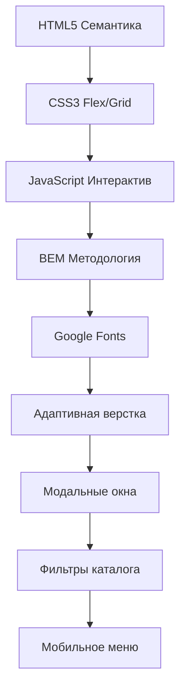

# 🏠 Interier — Мебель для вашего дома
---

## ✨ **Что это за проект?**

**Interier** — современный интернет-магазин премиальной мебели для всех комнат вашего дома. Элегантный дизайн, быстрая загрузка и удобная навигация создают идеальный шопинг-опыт.

### 🎨 **Для кого этот сайт**
- **Любители стиля** — подберите мебель для гостиной, кухни, спальни и ванной
- **Дизайнеры интерьеров** — вдохновляйтесь качественными фото и описаниями
- **Разработчики** — изучите чистый код и современные подходы к верстке

---

## 🚀 **Демо**
**[Посетить сайт](https://sidrik1.github.io/saitCatalog/site/index.html)**  
*Сайт автоматически развертывается на GitHub Pages*

---

## 📱 **Полностью адаптивный дизайн**

| Устройство | Статус |
|------------|--------|
| 💻 **Десктоп** (1920px+) | ✅ Работает идеально |
| 📱 **Планшет** (768px-1199px) | ✅ Адаптировано |
| 📱 **Мобильный** (до 767px) | ✅ Mobile First |

---

## 🛠 **Технологии и фичи**

### **✨ Ключевые возможности**
- 🔍 **Умный поиск** по сайту
- 🛒 **Рабочая корзина** с подсчетом итогов
- 🎨 **Фильтры каталога** (цена, цвет, доставка, комнаты)
- 📱 **Мобильное гамбургер-меню**
- 💫 **Плавные анимации** и hover-эффекты
- 📧 **Форма подписки** на новости

---

## 📂 **Структура проекта**
interier-site/
├── index.html # Главная страница
├── catalog.html # Каталог товаров
├── cart.html # Корзина и оформление
├── style.css # Все стили
├── img/ # Изображения товаров
└── README.md # Эта документация
